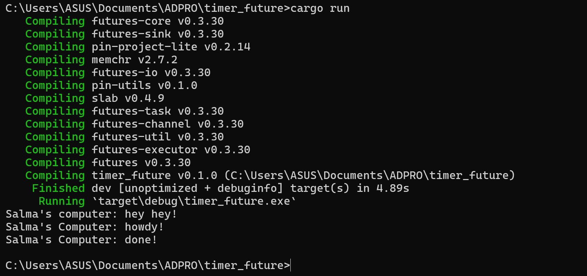
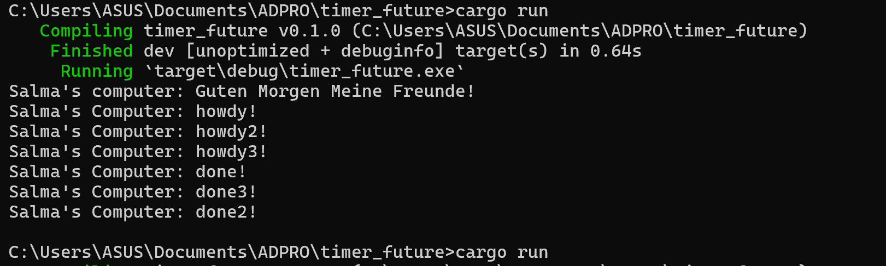

# Modul 10 Reflection
**Salma Kurnia Dewi (2206026681)** 

## 1.2 Understanding how it works 
***What happened when you run the program?***

Based on the image, the output 'hey hey' are printed before the 'howdy!' and 'done!'. This happened because the code ```!("Salma's Computer: hey hey!")``` is placed in the main thread outside of aynchronous task so it can run without waiting for the ```executor.run()``` to be executed first. 
Meanwhile, the code ```println!("Salma's Computer: howdy!")``` and ```println!("Salma's Computer: done!") are placed inside the asynchronous task and spawned with the code ```spawner.spawn(async{...}), where those codes can only run the ```executer.run()``` is executed first.  

## 1.3 Multiple Spawn and removing drop
***With drop command***


***Without drop command***


Based on the image, multiple tasks are concurrently spawned, leading to asynchronous and independent execution with an unpredictable sequence. Regardless of the task order, the output is consistently printed after the 'Guten Morgen Meine Freunde' in the main thread. However, without the 'drop' command, the program runs indefinitely as the executor, unaware of task completion, awaits further tasks. Thus, the 'drop' command is essential to signal task completion and ensure program termination.
